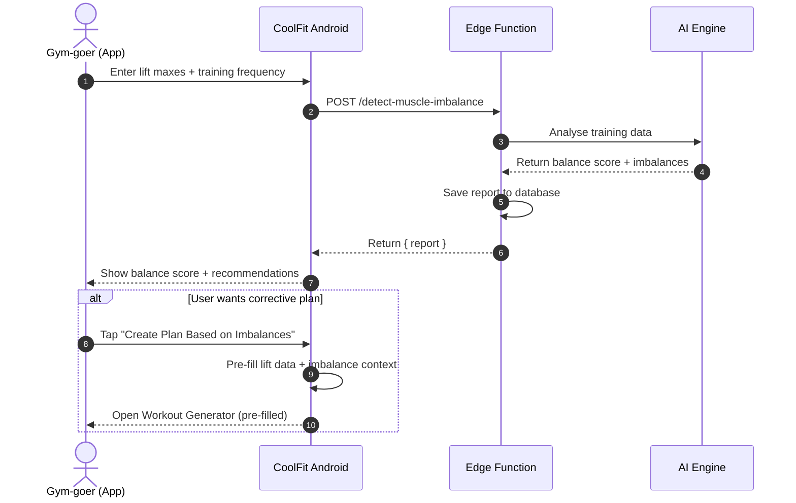

# 💪 CoolFit

[](https://kotlinlang.org/)
[](https://www.jetbrains.com/compose-multiplatform/)
[](https://supabase.com/)
[](https://developer.android.com/)
[](https://opensource.org/licenses/MIT)

An AI-powered fitness platform designed specifically for Indian Gujarati gym-goers. Built with real gym trainer input and a Masters-level nutrition expert, CoolFit delivers deeply personalised workout and diet plans, a muscle imbalance detection engine, and a community influencer system — all in one app.

<!-- Add screenshots here -->

---

## ⚡ What It Does

CoolFit solves four specific problems that Indian Gujarati gym-goers face every day.

### 1. Exercise Library with Correct Form Demonstrations
Most gym-goers learn exercises from watching others — which spreads incorrect form throughout gyms. CoolFit solves this with:

- **GIF-based demonstrations** of correct form for every exercise
- **9 muscle group categories** — Chest, Back, Shoulders, Biceps, Triceps, Legs, Glutes, Core, Full Body
- **Offline caching** — exercises load instantly even without internet after first use
- **Owner-curated content** — only verified exercises are added to the library

### 2. AI Workout Plan Generator Built with Real Trainer Input
Generic fitness apps ask three questions and produce the same plan for everyone. CoolFit goes deeper:

- **Trainer-designed questionnaire** — goals, experience level, equipment availability, session duration, injuries, and current lift maxes
- **Imbalance-aware planning** — if a muscle imbalance report exists, it is automatically pre-filled as context into the generator
- **Personalised output** — day-by-day workout split with sets, reps, rest periods, and form cues per exercise
- **Generation limits** — Free: 3 per month | Premium: 7 per month (independent from diet plan limit)

### 3. AI Diet Plan Generator Built with a Nutrition Expert
Diet apps ignore the food culture of their users. CoolFit was built differently:

- **Nutrition expert questionnaire** — age, weight, height, activity level, goal, dietary preference, allergies, and meals per day
- **Gujarati food options** — the plan includes authentic foods: rotli, dal, khichdi, paneer shaak, methi muthia, kadhi, moong dal, masala chhas
- **Full macro breakdown** — daily calorie target, protein, carbohydrates, and fat in grams per meal
- **Independent generation pool** — separate monthly limit from workout plans

### 4. Muscle Imbalance Detector — The Key Differentiator
No fitness app on the Indian market analyses your training data to detect imbalances. CoolFit does:

- **PR input** — Bench press, Squat, Deadlift, Overhead Press, and Pull-ups/Rows max
- **Training frequency input** — days per week per muscle group and total training duration
- **Balance score** — AI produces an overall score from 0 to 100 with severity ratings
- **Corrective recommendations** — specific exercises and volume adjustments per lagging area
- **One-tap plan generation** — after the report, user is taken directly to the workout generator with imbalance data pre-filled

---

## ✨ Additional Features

### ⭐ S-TIER Exercise Section *(Premium)*
- Curated list of viral and trending exercises reviewed for safety and effectiveness
- Global list maintained exclusively by the app owner
- Each influencer can add their own picks visible only to their group members
- Completely hidden from free users — a key incentive to upgrade

### 👥 Influencer System & Admin Panel
- Multiple influencers can exist on the platform simultaneously
- Users request to join influencer groups from inside the app
- Influencers approve or reject requests via their own admin panel
- Influencers manage their own member slots, S-TIER content, and group

---

## 🛠️ Technology Stack

| Layer | Technology | Purpose |
| :--- | :--- | :--- |
| **Language** | Kotlin Multiplatform | Shared business logic and UI across Android and iOS |
| **UI Framework** | Compose Multiplatform | One Compose UI codebase running on Android and iOS |
| **Navigation** | Voyager | Purpose-built navigation for Compose Multiplatform |
| **Networking** | Ktor Client | KMP-compatible HTTP client (OkHttp on Android, Darwin on iOS) |
| **Local Database** | SQLDelight | Type-safe SQL for KMP — Android and iOS compatible |
| **Dependency Injection** | Koin | Lightweight DI fully compatible with Kotlin Multiplatform |
| **Image + GIF Loading** | Coil 3 | KMP image loading with platform-specific GIF rendering |
| **Backend Platform** | Supabase | Managed PostgreSQL, Auth, Storage, and Edge Functions |
| **Database** | PostgreSQL (via Supabase) | Relational data — users, plans, permissions, imbalance reports |
| **Server Functions** | Supabase Edge Functions (TypeScript/Deno) | AI API calls, generation limits, business logic |
| **Min Android SDK** | API 26 (Android 8.0) | Covers 98%+ of active Android devices |

---

## 🏗️ Architecture

CoolFit follows Clean Architecture with three strict layers. No layer communicates with a layer it should not.

### Layer Overview

```
┌─────────────────────────────────────────────────────┐
│              PRESENTATION LAYER                     │
│     Compose Screens + ScreenModels (ViewModels)     │
│     Handles UI state, user events, navigation       │
└─────────────────────┬───────────────────────────────┘
                      │ calls
┌─────────────────────▼───────────────────────────────┐
│                DOMAIN LAYER                         │
│              UseCases only                          │
│     Business logic — no UI, no database direct      │
└─────────────────────┬───────────────────────────────┘
                      │ calls
┌─────────────────────▼───────────────────────────────┐
│                 DATA LAYER                          │
│    Repositories → Remote Source + Local Source      │
│    Remote: Supabase PostgREST + Edge Functions      │
│    Local: SQLDelight (on-device cache)              │
└─────────────────────┬───────────────────────────────┘
                      │ calls
┌─────────────────────▼───────────────────────────────┐
│                  BACKEND                            │
│         Supabase Edge Functions (TypeScript)        │
│         AI API calls happen here ONLY               │
│         Generation limits enforced here             │
└─────────────────────────────────────────────────────┘
```

### AI Call Flow

```
Android App
    │
    │  POST /functions/v1/generate-workout-plan
    │  { questionnaire data }
    ▼
Supabase Edge Function
    │
    ├── Check generation limit from generation_usage table
    ├── If limit reached → return 429
    │
    ├── Build AI prompt from questionnaire
    ├── Call AI API (server-side only — key never in app)
    ├── Parse JSON plan from AI response
    │
    ├── Increment generation_usage count
    ├── Save plan to workout_plans table
    │
    └── Return { plan } to app
```

### Muscle Imbalance Detection Flow



---

## 👤 User Types & Permissions

| User Type | How They Join | What They Can Access |
|-----------|--------------|----------------------|
| **Free** | Register directly | Exercise library, 3 AI workout generations/month, 3 AI diet generations/month, muscle imbalance detector |
| **Premium** | Approved by an influencer | Everything free + S-TIER exercises + 7 generations/month per feature |
| **Influencer** | Manually onboarded by app owner | Everything premium + admin panel + manage member slots + add custom S-TIER exercises |
| **App Owner** | Built-in superadmin | Full platform control — add exercises, manage global S-TIER, manage all influencers |

---

## 🗄️ Database Schema

All 9 tables use PostgreSQL via Supabase with **Row Level Security (RLS) enabled on every table**. No user can access data they are not authorised to see — enforced at the database level, not just the application level.

| Table | Purpose |
|-------|---------|
| `users` | User profiles, type (free/premium/influencer/owner), fitness level |
| `exercises` | Exercise library — name, GIF URL, muscle group, difficulty |
| `stier_exercises` | S-TIER curated exercises — global list and per-influencer additions |
| `influencers` | Influencer profiles, max slots, used slots |
| `influencer_join_requests` | User join requests with pending/approved/rejected status |
| `workout_plans` | AI-generated workout plans stored as JSONB per user |
| `diet_plans` | AI-generated diet plans stored as JSONB per user |
| `muscle_imbalance_reports` | Lift maxes, training frequency, and AI-generated report per user |
| `generation_usage` | Monthly AI generation count per user per feature (resets each month) |

---

## ⚡ Backend Edge Functions

All AI calls happen server-side inside Supabase Edge Functions. The AI API key never touches the mobile app.

| Function | Trigger | What It Does |
|----------|---------|--------------|
| `check-generation-limit` | Before any AI generation | Checks monthly usage count — returns can_generate, used, limit, remaining |
| `generate-workout-plan` | User submits questionnaire | Enforces limit, calls AI, saves plan, increments usage |
| `generate-diet-plan` | User submits diet questionnaire | Same flow as workout — separate monthly pool |
| `detect-muscle-imbalance` | User submits lift data | Calls AI analysis, saves report to database |

---

## 🚀 Quick Start

### Prerequisites

- Android Studio Panda 4 (2025.3.4) or newer
- Node.js 22.x LTS
- Supabase CLI 2.x
- Deno 2.x
- Git

### Step-by-Step Setup

#### 1. Clone the Repository
```bash
git clone https://github.com/kavsss027/FitnessApp.git
cd FitnessApp
```

#### 2. Configure Supabase
Create a project at [supabase.com](https://supabase.com) and run the schema from the SQL editor.

Add your Supabase credentials to `local.properties` at the project root:
```properties
SUPABASE_URL=your_supabase_project_url
SUPABASE_ANON_KEY=your_supabase_anon_key
```

#### 3. Configure Backend Secrets
Add your AI API key to `supabase/.env.local`:
```env
GEMINI_API_KEY=your_api_key_here
```

#### 4. Link Supabase CLI
```bash
supabase login
supabase link --project-ref your_project_ref
```

#### 5. Deploy Edge Functions
```bash
supabase functions deploy check-generation-limit
supabase functions deploy generate-workout-plan
supabase functions deploy generate-diet-plan
supabase functions deploy detect-muscle-imbalance
```

#### 6. Open in Android Studio
```
File → Open → select the project folder
Wait for Gradle sync to complete
```

#### 7. Run on Emulator
```
Tools → Device Manager → Create Virtual Device (Pixel 8, API 35+)
Click the green ▶ Run button
```

---

## 🧪 Testing

CoolFit includes a unit test suite covering repositories, use cases, data model validation, and Koin DI graph verification.

```bash
./gradlew test
```

**Current test status:** 17 tests passing ✅

Test coverage includes:
- `AuthRepository` — 4 tests
- `FitnessRepository` — 3 tests
- `WorkoutScreenModel` — 4 tests
- `DataModelValidation` — 5 tests
- `KoinVerification` — 1 test

---

## 🗺️ Roadmap

- [x] Exercise Library with GIF demonstrations
- [x] AI Workout Plan Generator
- [x] AI Diet Plan Generator with Gujarati food options
- [x] Muscle Imbalance Detector with corrective recommendations
- [x] S-TIER Premium Exercise Section
- [x] Influencer System and Admin Panel
- [x] Onboarding flow — Beginner and Intermediate paths
- [x] 17 unit tests passing
- [x] CI/CD pipeline configured
- [x] Release APK build
- [ ] iOS App Store release
- [ ] Weekly and monthly training followups
- [ ] In-app payment processing
- [ ] Social features and community feed
- [ ] Video demonstrations alongside GIFs
- [ ] Training session logs

---

## 🤝 Contributing

Contributions make the open-source community an amazing place to learn, inspire, and create. All contributions are greatly appreciated.

1. Fork the repository
2. Create your feature branch: `git checkout -b feature/AmazingFeature`
3. Commit your changes: `git commit -m 'Add AmazingFeature'`
4. Push to the branch: `git push origin feature/AmazingFeature`
5. Open a Pull Request

---

## 📄 License

Distributed under the **MIT License**. See `LICENSE` for more information.

---

*Disclaimer: CoolFit is a fitness planning tool and does not constitute official medical, nutritional, or professional fitness advice. Always consult a qualified professional before starting any new fitness or diet programme.*
